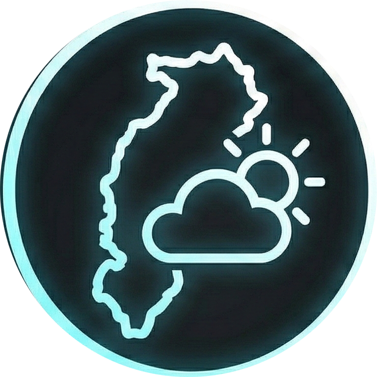

<div align="center">
  
  
  # VisionFlow 

  A modern web application for discovering and monitoring the best stargazing locations in Chhattisgarh. Track real-time night sky conditions, star visibility, cloud cover, and light pollution across multiple locations.
</div>

## ⚠ Important Note

**This project currently does not use any backend or external API.**

All displayed values (visibility, cloud cover, pollution, metrics, charts) are **static demo data for UI demonstration only**.

### ⚡ Converting to a Real-Time System

If you want to convert this into a fully functional real-time sky monitoring system, you can integrate the following APIs:

- **[OpenMeteo Astronomy API](https://open-meteo.com/)** – real-time visibility, moon & cloud forecast
- **[OpenWeather API](https://openweathermap.org/api)** – weather, humidity, wind conditions
- **[Air Pollution API](https://openweathermap.org/api/air-pollution)** – live pollution index
- **[OpenElevation API](https://open-elevation.com/)** – elevation scoring
- **Light Pollution datasets** – sky brightness levels

These APIs will allow you to fetch:
- ✓ Real-time visibility
- ✓ Cloud percentage
- ✓ Hourly trends
- ✓ Pollution index
- ✓ Humidity & wind
- ✓ Forecast graphs

## ✦ Features

### Live Features

- ✓ Real-time star visibility score
- ✓ Cloud cover, humidity, wind speed & sky clarity metrics
- ✓ Light pollution index (Bortle/SQM-based)
- ✓ Interactive district-wise night-sky map
- ✓ Hourly & 24-hour visibility forecasts
- ✓ Best observation time suggestions
- ✓ Location comparison tool
- ✓ Automated recommendations for top 5 spots
- ✓ Detailed yearly trend graphs for visibility & pollution
- ✓ Dark/Light theme support

### Landing Page

This is the introductory hero page of the platform.

It highlights:
- Purpose of the app — discovering the best stargazing locations in Chhattisgarh
- A dynamic, animated night-sky UI
- An interactive district map
- Quick actions: Open Dashboard and Learn More

This page sets the visual identity of the project and guides the user toward deeper exploration.


### Dashboard

Live sky monitoring showing visibility, cloud cover, pollution index, hourly trends, and key metrics for selected districts.

### Sky Alerts & Monitoring

Shows real-time sky alerts (Excellent, Warning, Info), current monitoring location with map and key stats, and the best observation time windows for tonight. Helps users quickly understand sky conditions and plan stargazing sessions.


### Locations Explorer

An interactive night-sky map of Chhattisgarh where markers display local sky conditions.

Users can:
- Hover or click markers to see visibility, cloud cover, and pollution
- Explore districts visually
- Get instant access to detailed sky reports for each region

Perfect for location-based sky watchers and explorers.


### Recommendations Page

Displays the best stargazing spot for tonight based on visibility, cloud cover, and light pollution. Includes key reasons for recommendation and a sky quality timeline showing expected clarity throughout the night.


### Top 5 Locations

Displays the top 5 stargazing locations for tonight, ranked by visibility, cloud cover, and pollution. Each card highlights key advantages and the best viewing time, helping users quickly choose the ideal spot.


### Location Details

Shows an in-depth sky report for a selected location, including visibility, cloud cover, light pollution, and elevation. Includes yearly trend charts and hourly forecasts to help users understand long-term and real-time sky conditions.


### Comparison Page

Allows users to compare two locations side-by-side based on visibility, cloud cover, and light pollution. Includes distance, key metrics, and quick insights to help choose the better stargazing spot.


### Detailed Metrics Comparison

Provides a side-by-side breakdown of all major sky observation metrics—visibility, cloud cover, light pollution, elevation, humidity, and wind speed—along with a 12-month visibility comparison chart to analyze long-term trends between two locations.


## ▸ Tech Stack


- **React** - UI library for building interactive interfaces
- **Vite** - Fast build tool and dev server
- **React Router** - Client-side routing
- **Recharts** - Data visualization and charting
- **Leaflet** - Interactive maps with React Leaflet
- **Lucide React** - Modern icon library
- **React Icons** - Additional icon components

## ▸ Installation

1. Clone the repository:
```bash
git clone https://github.com/ravindra-y/VisionFlow.git
cd VisionFlow
```

2. Install dependencies:
```bash
npm install
```

3. Start the development server:
```bash
npm run dev
```

4. Open your browser and navigate to `http://localhost:5173`

## ▸ Available Scripts

- `npm run dev` - Start development server
- `npm run build` - Build for production
- `npm run preview` - Preview production build
- `npm run lint` - Run ESLint for code quality

## ▸ Project Structure

```
VisionFlow/
├── public/              # Static assets
├── src/
│   ├── assets/         # Images and media files
│   ├── components/     # Reusable React components
│   │   ├── Background/ # Animated backgrounds
│   │   ├── DashboardFeatures/
│   │   ├── ExploreChhattisgarh/
│   │   ├── Features/
│   │   ├── Footer/
│   │   ├── Hero/
│   │   ├── LocationMap/
│   │   ├── Navbar/
│   │   └── SkyVisibilityChart/
│   ├── pages/          # Page components
│   │   ├── HomePage.jsx
│   │   ├── DashboardPage.jsx
│   │   ├── LocationsPage.jsx
│   │   ├── ComparisonPage.jsx
│   │   └── RecommendationsPage.jsx
│   ├── App.jsx         # Main app component
│   ├── main.jsx        # Entry point
│   └── mockData.js     # Sample data
└── package.json
```

## ▸ Features Overview

### Dashboard
View comprehensive analytics including:
- Current sky conditions
- Visibility metrics
- Weather data
- Historical trends

### Locations
Explore stargazing locations with:
- Interactive map interface
- Location details and ratings
- Accessibility information
- Real-time conditions

### Recommendations
Get smart suggestions based on:
- Current weather conditions
- Light pollution levels
- Cloud cover
- Visibility scores

### Comparison
Compare multiple locations by:
- Side-by-side metrics
- Visibility charts
- Weather conditions
- Best time predictions

## ▸ Design Features

- Stunning animated starfield backgrounds
- Shooting stars effects
- Smooth transitions and animations
- Dark mode optimized interface
- Responsive grid layouts
- Interactive data visualizations

## ▸ Contributing

Contributions are welcome! Please feel free to submit a Pull Request.

## ▸ License

This project is open source and available under the MIT License.

## ▸ Author

**Chhatrapati Sahu**  
- GitHub: [@Chhatrapati-sahu-09](https://github.com/Chhatrapati-sahu-09)

**Ravindra Y**
- GitHub: [@ravindra-y](https://github.com/ravindra-y)

---

Made with ♥ for astronomy enthusiasts and stargazers

